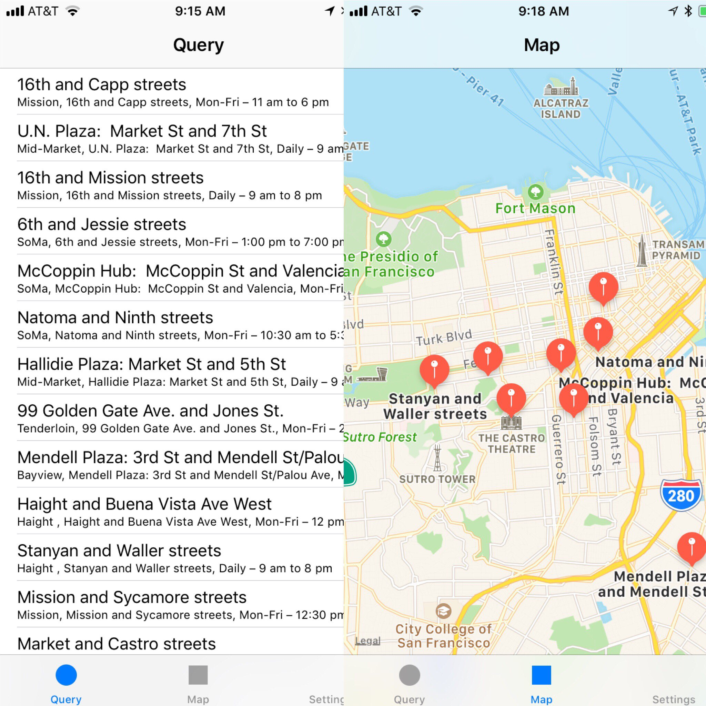

# whereclosest
This is an iOS application following a Domain Driven Design approach (with Ports and Adapters) that queries several different San Francisco specific data sources. 

# Data Sources

The data presented is currently of interest to humans but there are the beginnings of a canine mode.

## User Context

The initial idea seed came from a discussion about a hypothetical situation where Crohn's Disease or other GI issues (colitis, IBS, etc) creates an immediate need for a restroom.  Of course you can use a maps application and find a gas station or (more likely these days) a coffee shop - but you get the idea - a ranking system on the backend would then enable a crowd sourced pool of information to guide quick decision making with quality and safety in mind.

## Pit Stop Database

The _Pit Stop_ database is a database of public restrooms in San Francisco. 

https://dev.socrata.com/foundry/data.sfgov.org/snkr-6jdf

The _Street Tree List_ is a database of trees planted and maintained by the San Francisco Department of Public Works. Hence the mention of a canine mode.

https://dev.socrata.com/foundry/data.sfgov.org/2zah-tuvt

Building out on this theme, the idea of *wherecloset* can expand in a modular and pluggable way to places of interest based on location, proximity and context.

## Tide Tables 

Following the line of reasoning for finding where the closest is of something - what is more enjoyable thought experiment is the pursuit of optimal waves based on the local tide tables. 

For a surfer, kayaker or stand up boarder there are Tide Tables published as open data sources as per the API endpoint from NOAA desribed here:

https://tidesandcurrents.noaa.gov/api/

See below for the current (today) Tide Predictions at Station ID = 9414131 - which is Pillar Point Harbor, CA by Half Moon Bay, CA.

https://tidesandcurrents.noaa.gov/noaatidepredictions.html?id=9414131

## Bluetooth Low Energy 

There are a number of actual and hypothetical use cases around BLE connectivity.

As an engineer who works in the area of software engineering, primarily for medical devices - I have had an interest in using proximity detection of Beacons to trigger workflow actions such as through web hooks and other services. These could range from actions relevant in a "smart home" such as turning on lights to trigging fetching, building and running code *automagically*.

Data collection from an external device such as a Polar Heart Rate Monitor or other medical device is a prime example.

# Design Surface

So putting this all together - how this fits with Domain Driven Design is that additional specific Application Services and in turn Query objects would reside behind Adapters to provide data to the user to guide decision making but keeping the overall scaffolding of the application design and implementation roughly consistent.  There are roughly similar use cases finding "where closest" but different underpinnings and code behind.

The Type System to reach better abstraction for the different Query objects, but you get the gist...

# screens

